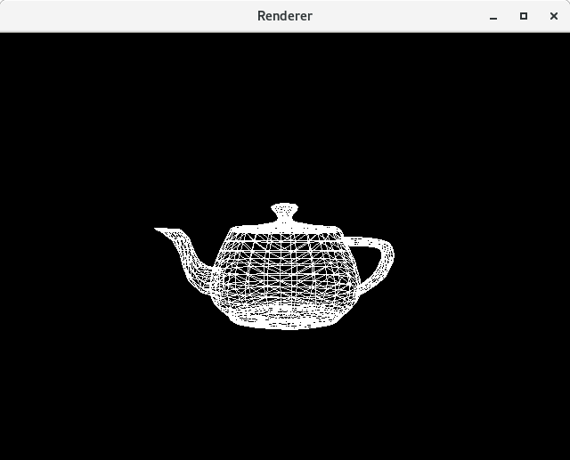

# Build
``` shell
$ make && ./renderer
```

# Notes
Voilà le point d'entrée du renderer. Cette fonction s'occupe de rendre une liste de triangles.
``` c++
void renderTriangles(SDL_Renderer* renderer, vec3_t* triangles, int vertexCount, 
    const mat4_t& viewportMatrix,
    const mat4_t& projection,
    const mat4_t& view,
    const mat4_t& model)
```

L'étape suivante consiste à calculer la transformation qui permet de passer les coordonnées d'un vertex de son repère local (sa position dans le modèle), à sa position dans le [clip-space](https://en.wikipedia.org/wiki/Clip_coordinates).
``` c++
// Precompute matrix transformations (local space -> clip space)
mat4_t mvp = projection * view * model;
```
Cet espace est nommé clip-space car c'est à ce moment qu'on effectue le clipping. Là, on stocke donc les coordonnées en clip-space des 3 points du triangles.
``` c++
// ====================================
// Calculate clip coords of the triangle
vec4_t clipCoords[3];
for (int j = 0; j < 3; ++j)
{
    clipCoords[j] = mvp * vec4::vec4(triangles[i + j], 1.f);
}
...
if (clip)
    continue;
```
Dans cet exemple, j'ai décidé d'ignorer les triangles si un de leurs 3 vertex est en dehors du clip-space. Pour être correct, il faudrait détecter si le triangle est en intersection avec le clip-space et le découper en s'aidant de l'[algorithme de Sutherland–Hodgman](https://en.wikipedia.org/wiki/Sutherland%E2%80%93Hodgman_algorithm).

Ensuite en divisant les coordonées homogènes par `w`, on obtient la position dans le NDC space. Tous les objets visibles ont alors leurs coordonnées comprises entre -1 et 1 (`-1 <= x <= 1`, `-1 <= y <= 1` et `-1 <= z <= 1`).
``` c++
// ====================================
// Caculate NDC coords
vec3_t ndcCoords[3];
for (int j = 0; j < 3; ++j)
{
    ndcCoords[j] = clipCoords[j].xyz / clipCoords[j].w;
}
```

On finit avec les coordonnées écrans, qu'on calcule en utilisant la matrice qui stocke la transformation du NDC space (-1, 1) vers le screen space (0, screen-size).
``` c++
// ====================================
// Caculate screen coords
vec2_t screenCoords[3];
for (int j = 0; j < 3; ++j)
{
    screenCoords[j] = (viewportMatrix * vec4::vec4(ndcCoords[j], 1.f)).xy;
}
```

Il ne reste plus qu'à afficher le triangle en s'aidant de ces coordonnées 2D.
``` c++
// ====================================
// Draw triangle
rasterizeTriangle(renderer, screenCoords);
```

